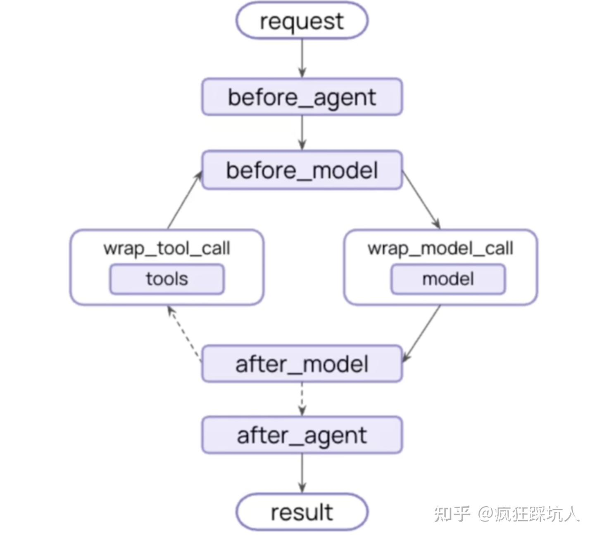

This files aims to demonstrate how to use LangChain by showing most of its features.

It will utilize the DCDClient as tools and ZHIPU as model to demonstrate the use of LangChain.

It will include some unnessary functions to show langchain's features.

I expect to attach some explainations with the code to make it easier to understand.

#### Model

##### - Simple agent that only include model 

Agent is the core of LangChain, it is responsible for managing the conversation and calling tools. 

Agent includes interactions with models, tools, structure, memory, and prompts.


Model is the key part of an agent. As shown below, the model can be easily used to generate text.


```python

import os
from dotenv import load_dotenv #obtain information from .env file
from langchain_community.chat_models import ChatZhipuAI


load_dotenv()
api_key = os.getenv("ZHIPU_API_KEY")

model = ChatZhipuAI(
    api_key=api_key,
    model="glm-4",
    temperature=0.9,
    max_tokens=1024,
    stop=["\n"],
    timeout = 60,
)
response = model.invoke("请用50字介绍一下ZHIPU Ai？")
print(response.content)
```

    d:\py_dev\demo_notebook\.venv\Lib\site-packages\jwt\api_jwt.py:153: InsecureKeyLengthWarning: The HMAC key is 16 bytes long, which is below the minimum recommended length of 32 bytes for SHA256. See RFC 7518 Section 3.2.
      return self._jws.encode(
    

    ZHIPU AI，中国领先AI企业，专注于大语言模型研发，打造通义千问等智能产品，赋能千行百业智能化升级。
    

The response can be in different form. 


```python
response = model.stream("用5字介绍一下ZHIPU Ai") 
for chunk in response:
    print(chunk.text)
```

    智
    谱
    AI
    
    
    


```python
response = model.batch(["用5字介绍一下ZHIPU Ai","用20字介绍一下ZHIPU Ai"])
for i, res in enumerate(response):
    print(f"Result {i+1}:\n{res.content}\n")
```

    Result 1:
    智谱AI
    
    Result 2:
    智能大模型，赋能创新，智启未来。
    
    

#### Output Format

You may choose the output format you prefer or desgin your own output format.

##### OutputParser

you may use 'chain' to illustrate how langchain is built. The outputparser is used to demonstrate how the output is parsed.


```python
from langchain_core.output_parsers import StrOutputParser
chain = model | StrOutputParser()
response = chain.invoke("What is the capital of France?")
print('response from str chain:')
print(response,'\n')


print('response from model:')
print(model.invoke("What is the capital of France?"))

```

    response from str chain:
    The capital of France is **Paris**. 
    
    response from model:
    content='The capital of France is **Paris**.' additional_kwargs={} response_metadata={'token_usage': {'completion_tokens': 10, 'prompt_tokens': 16, 'total_tokens': 26}, 'model_name': 'glm-4', 'finish_reason': 'stop'} id='lc_run--019c926a-071d-7343-ac46-ab44ec5ef00e-0' tool_calls=[] invalid_tool_calls=[]
    

##### with structured output

you may also design your own data structure as output


```python

from pydantic import BaseModel, Field

class Movie(BaseModel):
    """电影的相关信息"""
    title: str = Field(..., description="电影名称")
    year: int = Field(..., description="电影上映时间")
    director: str = Field(..., description="电影的导演")
    rating: float = Field(..., description="电影的豆瓣评分")

model_with_so = model.with_structured_output(Movie)
response = model_with_so.invoke("请介绍一下电影《肖申克的救赎》。")
print(response)

```

    title='肖申克的救赎' year=1994 director='弗兰克·德拉邦特' rating=9.7
    


```python
from langchain_core.output_parsers import JsonOutputParser

parser = JsonOutputParser(pydantic_object=Movie)

chain = model | parser
response = chain.invoke("请介绍一下电影《肖申克的救赎》。并用JSON格式返回，包含title, year, director, rating字段")
print(response)

```

    d:\py_dev\demo_notebook\.venv\Lib\site-packages\jwt\api_jwt.py:153: InsecureKeyLengthWarning: The HMAC key is 16 bytes long, which is below the minimum recommended length of 32 bytes for SHA256. See RFC 7518 Section 3.2.
      return self._jws.encode(
    

    {'title': 'The Shawshank Redemption', 'year': 1994, 'director': 'Frank Darabont', 'rating': 9.3}
    

Using JsonOutputParser requires your output to be a valid JSON string. You will need to use system prompt or mention in your prompt that the output should be a JSON string.

#### Tools

add tools through @tool decorator


```python

from langchain.tools import tool


@tool
def get_movie_info(movie_name: str) -> Movie:
    """根据电影名称获取电影信息"""
    # 这里可以调用数据库或者第三方API来获取电影信息
    # 这里只是一个示例，返回固定的电影信息
    if movie_name == "肖申克的救赎":
        return Movie(
            title="肖申克的救赎",
            year=1994,
            director="弗兰克·德拉邦特",
            rating=9.3
        )
    else:
        raise ValueError("未找到该电影的信息")
    
@tool
def get_movie_review(positive: bool) -> list[str]:
     
    """
    获取肖申克的救赎电影评论列表     
    Args:
        positive: 是否获取正面评论, True 表示获取正面评论, False 表示获取负面评论
    Returns:
        评论列表
    """
    positive_reviews = [
            "希望是人类最强大的力量，无论身处何种困境，永不放弃就能获得内心的自由。",
            "真正的自由在内心，任何高墙都无法囚禁一个充满希望和信念的灵魂。",
            "安迪用二十年如一日的坚持证明，耐心和智慧终将战胜一切不公与压迫。",
            "友谊跨越了高墙与偏见，瑞德和安迪之间深厚的信任感动了无数观众。",
            "体制化的牢笼最可怕，但保持希望和自我就能突破人生的任何困境。",
            ]
    negative_reviews = [
        "主角安迪形象过于完美圣洁，缺乏真实的人性挣扎和情绪变化，像个符号而非活人",
        "越狱过程漏洞百出，二十多年凿墙竟从未被发现，巧合太多缺乏真实感",
    ]
    return positive_reviews if positive else negative_reviews

```


```python
import json

from langchain_core.messages import HumanMessage, ToolMessage
model_with_tools = model.bind_tools([get_movie_info, get_movie_review])
prompt = "请分析肖申克的救赎电影的正面评论原因？"
response = model_with_tools.invoke(prompt) # AIMessage

tool_messages: list[ToolMessage] = []
for tool_call in response.tool_calls:
    print(f"Tool: {tool_call['name']}")
    print(f"Args: {tool_call['args']}")
    reviews = get_movie_review.invoke(tool_call["args"])
    tool_messages.append(
        ToolMessage(
            content=json.dumps(reviews, ensure_ascii=False),
            tool_call_id=tool_call["id"],
        )
    )

final_response = model_with_tools.invoke([HumanMessage(content=prompt), response, *tool_messages])
print(final_response.content)


```

    d:\py_dev\demo_notebook\.venv\Lib\site-packages\jwt\api_jwt.py:153: InsecureKeyLengthWarning: The HMAC key is 16 bytes long, which is below the minimum recommended length of 32 bytes for SHA256. See RFC 7518 Section 3.2.
      return self._jws.encode(
    

    Tool: get_movie_review
    Args: {'positive': True}
    
    基于获取到的《肖申克的救赎》电影正面评论，我来为您分析这部电影的正面评论原因：
    
    ## 《肖申克的救赎》正面评论原因分析
    
    ### 1. **希望的力量**
    评论中多次提到"希望是人类最强大的力量"，这反映了电影最核心的主题。即使在最黑暗的环境中，希望依然能够指引方向，给予人们精神力量。
    
    ### 2. **内在自由**
    评论强调"真正的自由在内心"，这表明观众深刻理解了电影传达的哲学观点：真正的自由不是外在环境的改变，而是内心世界的解放。即使身处监狱，依然可以保持心灵的自由。
    
    ### 3. **坚持与毅力**
    "安迪用二十年如一日的坚持证明"这一点突出了电影中展现的长期坚持和永不放弃的精神。这种持之以恒的毅力让观众深受感动和启发。
    
    ### 4. **友谊与信任**
    "友谊跨越了高墙与偏见"这一评论体现了电影中深厚的友谊主题。安迪和瑞德之间超越囚友关系的真挚友谊，展现了人性中最温暖的一面。
    
    ### 5. **对抗体制化**
    电影通过"体制化的牢笼"这一概念，揭示了社会环境和制度对人的异化影响，同时传达了保持自我、坚持信念的重要性。
    
    ### 总结
    《肖申克的救赎》的正面评论主要围绕着**希望、自由、坚持、友谊和人性尊严**这几个核心主题展开。电影通过一个看似绝望的故事，向观众展示了人性中最美好的一面，给予人们面对困境的勇气和力量，这就是它能引起广泛共鸣并获得高度评价的根本原因。
    

#### Agent

now we are familiar with tools, models, and output parser. Agent helps us to combine them to solve complex problems. 

Besides this basic function, there are another two important functions in agent:

Memory: It is used to store the conversation history.

Middleware: It is used to modify the input and output of the agent.

Let's see how they works in a langchain agent.


```python
from langchain.agents import create_agent

from langgraph.checkpoint.memory import InMemorySaver

SYSTEM_PROMPT = """你是一个电影智能助手，你需要根据用户输入的指令，进行电影推荐。
。"""

agent = create_agent(
    model,
    system_prompt=SYSTEM_PROMPT,
    tools=[get_movie_info, get_movie_review],
    #response_format=StrOutputParser(),
    checkpointer=InMemorySaver(), # 这里使用内存checkpointer，实际使用中可以替换为文件或者数据库checkpointer
    middleware=[]
)
```


#### Middleware 


middleware includes use of function in differenent stage of agent
- @before_agent    
runs before agent
- @before_model 
runs before model
- @after_model
runs after model
- @after_agent
runs after agent
- @wrap_model_call
runs around model call
- @wrap_tool_call
runs around tool call



example of using middleware to change model used


```python
simple_model = ChatZhipuAI(
    api_key=api_key,
    model="glm-4",
    temperature=0.9,
    max_tokens=1024,
    stop=["\n"],
    timeout = 60,
)
complex_model = ChatZhipuAI(
    api_key=api_key,
    model="glm-4",
    temperature=0.9,
    max_tokens=1024,
    stop=["\n"],
    timeout = 600,
)

```


```python
from dataclasses import dataclass
from typing_extensions import Literal

from langchain.agents import create_agent
from langchain.agents.middleware import wrap_model_call,before_model
from langchain.agents.middleware.types import ModelRequest, ModelResponse,AgentState
from langgraph.checkpoint.memory import InMemorySaver

# Optional: if ChatZhipuAI not in current namespace, uncomment:
# from langchain_community.chat_models import ChatZhipuAI

# Base/default model (will be overridden by middleware)
glm_model = simple_model

@dataclass
class AppContext:
    user_id: str


def _judge_complexity(user_text: str) -> Literal["simple", "complex"]:
    simple_output_model = simple_model | StrOutputParser()
    res = simple_output_model.invoke(
        [
            {
                "role": "system",
                "content": (
                    "你是问题复杂度分类器。"
                    "只输出一个词：simple 或 complex。\n"
                    "simple: 简单事实问答、简短翻译润色、无需多步推理。\n"
                    "complex: 多步推理、方案设计、复杂代码/调试、严谨推导。"
                ),
            },
            {"role": "user", "content": user_text},
        ]
    )
    if "simple" in res or "简单" in res:
        return "simple"
    if "complex" in res or "复杂" in res:
        return "complex"
    return "complex"

@wrap_model_call
def dynamic_model_selection(request: ModelRequest, handler) -> ModelResponse:
    """
    Dynamic model selection based on user input.
    """
    user_text = request.messages[0].content
    print(f"[Router] user_text={user_text}")
    complexity = _judge_complexity(user_text)
    selected_model = simple_model if complexity == "simple" else complex_model

    print(f"[Router] complexity={complexity}, model={selected_model.model_name}")
    return handler(request.override(model=selected_model))


def test_dynamic_model_selection():
    checkpointer = InMemorySaver()

    agent = create_agent(
        model=glm_model,
        tools=[],  # add tools here if needed
        context_schema=AppContext,
        checkpointer=checkpointer,
        middleware=[dynamic_model_selection],
    )

    config = {"configurable": {"thread_id": "difficulty-route-1"}}

    # complex question
    r1 = agent.invoke(
        {
            "messages": [
                {
                    "role": "user",
                    "content": "1.9 和 1.11 哪个数字大？请一步一步解释原因。",
                }
            ]
        },
        config=config,
        context=AppContext(user_id="1"),
    )
    m1 = r1["messages"][-1]
    print("\n[Complex Q] Answer:\n", m1.content)
    print("[Complex Q] model:", m1.response_metadata.get("model_name", "unknown"))

    # simple question
    r2 = agent.invoke(
        {"messages": [{"role": "user", "content": "法国首都是哪里？"}]},
        config={"configurable": {"thread_id": "difficulty-route-2"}},
        context=AppContext(user_id="1"),
    )
    m2 = r2["messages"][-1]
    print("\n[Simple Q] Answer:\n", m2.content)
    print("[Simple Q] model:", m2.response_metadata.get("model_name", "unknown"))

test_dynamic_model_selection()

```

    [Router] user_text=1.9 和 1.11 哪个数字大？请一步一步解释原因。
    

    d:\py_dev\demo_notebook\.venv\Lib\site-packages\jwt\api_jwt.py:153: InsecureKeyLengthWarning: The HMAC key is 16 bytes long, which is below the minimum recommended length of 32 bytes for SHA256. See RFC 7518 Section 3.2.
      return self._jws.encode(
    

    [Router] complexity=complex, model=glm-4
    

    d:\py_dev\demo_notebook\.venv\Lib\site-packages\jwt\api_jwt.py:153: InsecureKeyLengthWarning: The HMAC key is 16 bytes long, which is below the minimum recommended length of 32 bytes for SHA256. See RFC 7518 Section 3.2.
      return self._jws.encode(
    

    
    [Complex Q] Answer:
     好的，我们来一步一步地解释为什么 1.11 比 1.9 大。
    
    为了清晰地比较这两个小数，最好的方法是**将它们的小数点对齐**，然后从左到右逐位进行比较。
    
    ---
    
    ### **第一步：写出数字并小数点对齐**
    
    让我们把这两个数字像做数学竖式一样写下来，确保它们的小数点对齐：
    
    ```
      1.11
      1.9
    ```
    
    为了让我们能更清楚地比较每一位，我们可以把 1.9 看成 1.90。在小数末尾添加一个 0，并不会改变这个数字的大小。
    
    所以，我们写成：
    
    ```
      1.11
      1.90
    ```
    
    ### **第二步：从左到右逐位比较**
    
    现在我们从左到右，一位一位地进行比较。
    
    **比较整数部分：**
    - 1.11 的整数部分是 **1**。
    - 1.90 的整数部分是 **1**。
    
    **结论：** 整数部分相同，都是 1。所以我们需要继续比较小数部分。
    
    **比较小数点后的第一位（十分位）：**
    - 1.11 的十分位上的数字是 **1**。
    - 1.90 的十分位上的数字是 **9**。
    
    **关键点来了：**
    数字 1 和 9，哪个更大？很明显，**9 比 1 大**。
    
    ### **第三步：得出结论**
    
    因为在比较小数部分的第一位（十分位）时，1.90 的数字（9）已经比 1.11 的数字（1）大了，那么无论后面的数字是什么，1.90 都已经比 1.11 大了。
    
    因此，我们不需要再继续比较小数点后第二位的数字（1 和 0）了。
    
    ---
    
    ### **总结**
    
    1.  **对齐小数点**：比较小数时，首先要将小数点对齐，这样才能保证相同数位上的数字进行比较。
    2.  **从左到右比较**：从整数部分开始，然后是小数部分的第一位（十分位）、第二位（百分位）……
    3.  **找到决定性差异**：
        *   1.11 和 1.9 的整数部分相同（都是1）。
        *   它们小数点后的第一位分别是 **1** 和 **9**。
        *   因为 **9 > 1**，所以我们可以确定 1.9 比 1.11 大。
    
    **最终答案：1.11 比 1.9 小，而 1.9 比 1.11 大。**
    [Complex Q] model: glm-4
    [Router] user_text=法国首都是哪里？
    

    d:\py_dev\demo_notebook\.venv\Lib\site-packages\jwt\api_jwt.py:153: InsecureKeyLengthWarning: The HMAC key is 16 bytes long, which is below the minimum recommended length of 32 bytes for SHA256. See RFC 7518 Section 3.2.
      return self._jws.encode(
    

    [Router] complexity=simple, model=glm-4
    

    d:\py_dev\demo_notebook\.venv\Lib\site-packages\jwt\api_jwt.py:153: InsecureKeyLengthWarning: The HMAC key is 16 bytes long, which is below the minimum recommended length of 32 bytes for SHA256. See RFC 7518 Section 3.2.
      return self._jws.encode(
    

    
    [Simple Q] Answer:
     法国的首都是 **巴黎** (Paris)。
    
    巴黎不仅是法国的政治中心，也是该国最大的城市，以及全球在文化、艺术、时尚、美食和金融领域的重要城市之一。
    [Simple Q] model: glm-4
    


```python
from langchain.agents.middleware import before_model
from langchain.agents.middleware.types import AgentState,Runtime

@before_model
def model_selection_before(state:AgentState,runtime:Runtime) -> dict | None:
    """
    Dynamic model selection based on user input.
    """
    user_text = state["messages"][-1].content
    print(f"[Router] user_text={user_text}")
    complexity = _judge_complexity(user_text)
    selected_model = simple_model if complexity == "simple" else complex_model

    print(f"[Router] complexity={complexity}, model={selected_model.model_name}")
    return {
        "model_params": {
            "provider": "zhipu",
            "name": selected_model.model_name,
            "temperature": selected_model.temperature,
            "max_tokens": selected_model.max_tokens,
        }
    }

def test_dynamic_model_selection():
    checkpointer = InMemorySaver()

    agent = create_agent(
        model=glm_model,
        tools=[],  # add tools here if needed
        context_schema=AppContext,
        checkpointer=checkpointer,
        middleware=[model_selection_before],
    )

    config = {"configurable": {"thread_id": "difficulty-route-1"}}

    # complex question
    r1 = agent.invoke(
        {
            "messages": [
                {
                    "role": "user",
                    "content": "1.9 和 1.11 哪个数字大？请一步一步解释原因。",
                }
            ]
        },
        config=config,
        context=AppContext(user_id="1"),
    )
    m1 = r1["messages"][-1]
    print("\n[Complex Q] Answer:\n", m1.content)
    print("[Complex Q] model:", m1.response_metadata.get("model_name", "unknown"))

    # simple question
    r2 = agent.invoke(
        {"messages": [{"role": "user", "content": "法国首都是哪里？"}]},
        config={"configurable": {"thread_id": "difficulty-route-2"}},
        context=AppContext(user_id="1"),
    )
    m2 = r2["messages"][-1]
    print("\n[Simple Q] Answer:\n", m2.content)
    print("[Simple Q] model:", m2.response_metadata.get("model_name", "unknown"))

test_dynamic_model_selection()
```

    [Router] user_text=1.9 和 1.11 哪个数字大？请一步一步解释原因。
    

    d:\py_dev\demo_notebook\.venv\Lib\site-packages\jwt\api_jwt.py:153: InsecureKeyLengthWarning: The HMAC key is 16 bytes long, which is below the minimum recommended length of 32 bytes for SHA256. See RFC 7518 Section 3.2.
      return self._jws.encode(
    

    [Router] complexity=complex, model=glm-4
    

    d:\py_dev\demo_notebook\.venv\Lib\site-packages\jwt\api_jwt.py:153: InsecureKeyLengthWarning: The HMAC key is 16 bytes long, which is below the minimum recommended length of 32 bytes for SHA256. See RFC 7518 Section 3.2.
      return self._jws.encode(
    

    
    [Complex Q] Answer:
     好的，我们来一步一步地解释为什么 **1.11 比 1.9 大**。
    
    这个问题比较的是两个带小数点的数字，关键在于要比较它们的“小数部分”。
    
    ---
    
    ### **第一步：比较整数部分**
    
    首先，我们忽略小数点，只看左边的整数部分。
    *   数字 1.9 的整数部分是 **1**。
    *   数字 1.11 的整数部分也是 **1**。
    
    **结论：** 因为整数部分相同（都是1），所以我们无法直接判断大小，需要继续比较它们的小数部分。
    
    ---
    
    ### **第二步：比较小数部分（十分位）**
    
    现在我们来比较两个数字的小数点后面的第一位，也就是**十分位**。
    *   数字 1.9 可以写成 1.90。它的十分位上的数字是 **9**。
    *   数字 1.11 的十分位上的数字是 **1**。
    
    现在我们来比较这两个十分位上的数字：**9** 和 **1**。
    
    **结论：** 在十分位上，数字 **9** 大于数字 **1**。
    
    ---
    
    ### **第三步：得出最终结论**
    
    根据第二步的比较结果，我们已经找到了一个关键的区别：
    *   数字 1.9 在“十分位”上是9。
    *   数字 1.11 在“十分位”上是1。
    
    因为十分位上的9比1大，所以，无论百分位和以后是什么数字，只要十分位的数字大，整个数字就大。因此，**1.9 比 1.11 大**。
    
    ---
    
    ### **一个更直观的比喻**
    
    你可以把这两个数字想象成钱：
    *   **1.9** 就像是 **1元9角** (或者 1.90元)。
    *   **1.11** 就像是 **1元1角1分**。
    
    很显然，**1元9角** 比 **1元1角1分** 多，对吗？
    
    ---
    
    ### **总结**
    
    | 步骤 | 比较 1.9 和 1.11 |
    | :--- | :--- |
    | 1. **整数部分** | 都是 1，相同，需要继续比较。 |
    | 2. **小数部分（十分位）** | 1.9 的十分位是 **9**。 <br> 1.11 的十分位是 **1**。 |
    | 3. **比较大小** | **9** > **1** |
    | **最终结论** | 因为十分位上的9比1大，所以 **1.9 > 1.11**。 |
    
    所以，**1.9 这个数字更大**。
    [Complex Q] model: glm-4
    [Router] user_text=法国首都是哪里？
    [Router] complexity=simple, model=glm-4
    

    d:\py_dev\demo_notebook\.venv\Lib\site-packages\jwt\api_jwt.py:153: InsecureKeyLengthWarning: The HMAC key is 16 bytes long, which is below the minimum recommended length of 32 bytes for SHA256. See RFC 7518 Section 3.2.
      return self._jws.encode(
    

    
    [Simple Q] Answer:
     法国的首都是 **巴黎** (Paris)。
    
    巴黎不仅是法国的政治中心，也是该国最大的城市，以其悠久的历史、丰富的文化、艺术、时尚和美食而闻名于世界，被誉为“光之城”（La Ville Lumière）。
    
    **一些关于巴黎的有趣事实：**
    
    *   **政治中心**：法国总统府（爱丽舍宫）、总理府（马提尼翁府）、国会（国民议会和参议院）以及主要的政府机构都设在巴黎。
    *   **历史名城**：巴黎拥有超过2000年的历史，由塞纳河分为左岸和右岸，河上有多座著名的桥梁连接两岸。
    *   **文化地标**：埃菲尔铁塔、卢浮宫、巴黎圣母院、凯旋门和香榭丽舍大街等都是世界闻名的地标性建筑和景点。
    *   **国际都市**：作为一座国际化大都市，巴黎也是联合国教科文组织（UNESCO）的总部所在地，以及众多国际组织的总部。
    [Simple Q] model: glm-4
    

可见这两种middleware都可以根据输入改变语言模型，wrap能控制使用模型时的输入输出和期间报错等，而before和after能获取历史信息，改变模型状态。
需要注意的是，中间件的输入输出都是固定的：

wrap只能通过request获取输入，使用handler使用模型/工具，输出的一定是使用完后的结果。

before和after可以通过state获取状态信息，runtime获取静态信息，最后通过state改变模型状态，具体如下。state输出必须是序列化数据，如dict，如果不通过wrap去进行进一步处理，则必须按固定字典返回。


```python
from langgraph.runtime import Runtime
from langgraph.store.memory import InMemoryStore

@before_model
def show_info(state:AgentState,runtime:Runtime)->dict | None:
    print("state includes: ")
    print("state[messages]:")
    print(state["messages"][-1].content if state["messages"] else "no messages")

    print("runtime includes: ")
    print("runtime[context]:")
    print(runtime.context)
    print("runtime[store]:")
    print(runtime.store)
    # print("state[jump_to]:\n")
    # print(state["jump_to"])
    # print("state[structured response]:\n")
    # print(state["structured_response"])
    
    return None

agent = create_agent(model = simple_model,
                     middleware=[show_info],
                     store = InMemoryStore())
response = agent.invoke(
        {
            "messages": [
                {
                    "role": "user",
                    "content": "1.9 和 1.11 哪个数字大？",
                }
            ]
        },
        context = {"user_id": "test_user"} # 这里输入了runtime的context
    )
print("model response:")
print(response)
    
```

    state includes: 
    state[messages]:
    1.9 和 1.11 哪个数字大？
    runtime includes: 
    runtime[context]:
    {'user_id': 'test_user'}
    runtime[store]:
    <langgraph.store.memory.InMemoryStore object at 0x0000010F2E3D7A70>
    

    d:\py_dev\demo_notebook\.venv\Lib\site-packages\jwt\api_jwt.py:153: InsecureKeyLengthWarning: The HMAC key is 16 bytes long, which is below the minimum recommended length of 32 bytes for SHA256. See RFC 7518 Section 3.2.
      return self._jws.encode(
    

    model response:
    {'messages': [HumanMessage(content='1.9 和 1.11 哪个数字大？', additional_kwargs={}, response_metadata={}, id='937b2dc5-5f20-441a-8896-27c4fe834d32'), AIMessage(content='**1.11 比 1.9 大。**\n\n这是一个关于小数比较大数的问题，我们可以通过两种方法来理解：\n\n### 方法一：补零法\n\n为了方便比较，我们可以给数字补上相同数量的零，让它们的小数位数相同。\n\n*   **1.9** 可以写成 **1.90**\n*   **1.11** 保持不变\n\n现在我们来比较 **1.90** 和 **1.11**：\n\n1.  先比较整数部分：都是 **1**，一样大。\n2.  再比较小数部分的第一位（十分位）：\n    *   1.90 的十分位是 **9**\n    *   1.11 的十分位是 **1**\n    *   因为 **9 > 1**，所以 **1.90**（也就是 **1.9**）大于 **1.11**。\n\n### 方法二：分解法\n\n我们可以把这两个数字分解成整数和小数部分，然后相加：\n\n*   **1.9** = 1 + 0.9\n*   **1.11** = 1 + 0.11\n\n现在我们只需要比较小数部分 **0.9** 和 **0.11** 的大小即可。\n因为 0.9 = 0.90，而 0.90 > 0.11，所以 1.9 > 1.11。\n\n---\n\n**简单总结：**\n\n*   **1.9** 读作“一点九”，代表 1 又十分之九 (9/10)。\n*   **1.11** 读作“一点一一”，代表 1 又百分之一十一 (11/100)。\n\n十分之九 (90/100) 显然比百分之一十一 (11/100) 要大。', additional_kwargs={}, response_metadata={'token_usage': {'completion_tokens': 375, 'prompt_tokens': 24, 'total_tokens': 399}, 'model_name': 'glm-4', 'finish_reason': 'stop'}, id='lc_run--019c92ba-fc92-7df1-9cb6-fcde11b3a437-0', tool_calls=[], invalid_tool_calls=[])]}
    

#### 记忆(Memory)

##### checkpointer

checkpointer 可用于保存记忆，会根据id保存对应记忆


```python
# 无checkpointer
agent = create_agent(simple_model)
agent.invoke({"messages" : [{"role" : "user", "content" : "My name is John."}]})
response1 = agent.invoke({"messages" : [{"role" : "user", "content" : "what is my name?"}]})
print(response1["messages"][-1].content)
```

    d:\py_dev\demo_notebook\.venv\Lib\site-packages\jwt\api_jwt.py:153: InsecureKeyLengthWarning: The HMAC key is 16 bytes long, which is below the minimum recommended length of 32 bytes for SHA256. See RFC 7518 Section 3.2.
      return self._jws.encode(
    d:\py_dev\demo_notebook\.venv\Lib\site-packages\jwt\api_jwt.py:153: InsecureKeyLengthWarning: The HMAC key is 16 bytes long, which is below the minimum recommended length of 32 bytes for SHA256. See RFC 7518 Section 3.2.
      return self._jws.encode(
    

    As an AI, I don't have access to your personal information unless you provide it to me in our conversation. I don't know your real name.
    
    However, if you'd like, you can tell me what you'd like to be called, and I'll use that name for our future conversations!
    


```python
##### checkpointer
agent = create_agent(simple_model,checkpointer=InMemorySaver())
agent.invoke({"messages" : [{"role" : "user", "content" : "what is the meaning of life?"}]},
             {"configurable" : {"thread_id": "test_thread"}})
agent.invoke({"messages" : [{"role" : "user", "content" : "My name is John."}]},
             {"configurable" : {"thread_id": "test_thread2"}})
response1 = agent.invoke({"messages" : [{"role" : "user", "content" : "what is my name?"}]},
             {"configurable" : {"thread_id": "test_thread"}})
response2 = agent.invoke({"messages" : [{"role" : "user", "content" : "what is my name?"}]},
             {"configurable" : {"thread_id": "test_thread2"}})
print("response to first user: ",response1["messages"][-1].content)
print("response to second user: ",response2["messages"][-1].content)
```

    d:\py_dev\demo_notebook\.venv\Lib\site-packages\jwt\api_jwt.py:153: InsecureKeyLengthWarning: The HMAC key is 16 bytes long, which is below the minimum recommended length of 32 bytes for SHA256. See RFC 7518 Section 3.2.
      return self._jws.encode(
    d:\py_dev\demo_notebook\.venv\Lib\site-packages\jwt\api_jwt.py:153: InsecureKeyLengthWarning: The HMAC key is 16 bytes long, which is below the minimum recommended length of 32 bytes for SHA256. See RFC 7518 Section 3.2.
      return self._jws.encode(
    d:\py_dev\demo_notebook\.venv\Lib\site-packages\jwt\api_jwt.py:153: InsecureKeyLengthWarning: The HMAC key is 16 bytes long, which is below the minimum recommended length of 32 bytes for SHA256. See RFC 7518 Section 3.2.
      return self._jws.encode(
    d:\py_dev\demo_notebook\.venv\Lib\site-packages\jwt\api_jwt.py:153: InsecureKeyLengthWarning: The HMAC key is 16 bytes long, which is below the minimum recommended length of 32 bytes for SHA256. See RFC 7518 Section 3.2.
      return self._jws.encode(
    

    response to first user:  Based on our conversation so far, I don't have your name. We've only discussed the meaning of life.
    
    If you'd like to share your name with me, I'll remember it for our future conversations. Just let me know!
    response to second user:  Your name is John.
    

##### 消息管理 Summarizaion Middleware

langchain提供了summarizationmiddleware协助控制上文长度，可通过大模型总结上文内容。


```python
from langchain.agents.middleware import SummarizationMiddleware

@before_model
def print_history(state:AgentState,runtime:Runtime)->None:
    """打印所有用户输入历史"""
    message = state["messages"]
    print("用户输入历史：")
    for i in message:
        if i.type == "human":
            print(i.content,"\n")
    
checkpointer = InMemorySaver()
agent = create_agent(
    simple_model,
    system_prompt="请用30字以内中文回答。",
    middleware=[
        SummarizationMiddleware(
            model=simple_model,
            trigger=("messages", 3),
            keep=("messages", 3),
            summary_prefix="对话摘要：",
            summary_prompt="请将以下对话历史压缩成简短的中文摘要，保留关键信息（事实、偏好、约束、决定、结论）：\n{messages}",
            ),
            print_history
    ],
    checkpointer=checkpointer,
)
config = {"configurable": {"thread_id": "short-memory-demo"}}

```


```python
agent.invoke({"messages": [{"role": "user", "content": "What is the capital of France?"}]},config = config)
agent.invoke({"messages": [{"role": "user", "content": "I want to know the culture of France."}]},config = config)
agent.invoke({"messages": [{"role": "user", "content": "I want to plan a trip to France."}]},config = config)
agent.invoke({"messages": [{"role": "user", "content": "I want to know the history of France."}]},config = config)


```

    用户输入历史：
    What is the capital of France? 
    
    

    d:\py_dev\demo_notebook\.venv\Lib\site-packages\jwt\api_jwt.py:153: InsecureKeyLengthWarning: The HMAC key is 16 bytes long, which is below the minimum recommended length of 32 bytes for SHA256. See RFC 7518 Section 3.2.
      return self._jws.encode(
    

    用户输入历史：
    What is the capital of France? 
    
    I want to know the culture of France. 
    
    

    d:\py_dev\demo_notebook\.venv\Lib\site-packages\jwt\api_jwt.py:153: InsecureKeyLengthWarning: The HMAC key is 16 bytes long, which is below the minimum recommended length of 32 bytes for SHA256. See RFC 7518 Section 3.2.
      return self._jws.encode(
    

    用户输入历史：
    Here is a summary of the conversation to date:
    
    **摘要：**
    
    *   **事实：** 法国首都是巴黎。 
    
    I want to know the culture of France. 
    
    I want to plan a trip to France. 
    
    

    d:\py_dev\demo_notebook\.venv\Lib\site-packages\jwt\api_jwt.py:153: InsecureKeyLengthWarning: The HMAC key is 16 bytes long, which is below the minimum recommended length of 32 bytes for SHA256. See RFC 7518 Section 3.2.
      return self._jws.encode(
    

    用户输入历史：
    Here is a summary of the conversation to date:
    
    **摘要：**
    
    *   **事实：** 法国文化以艺术、美食、时尚和浪漫著称，历史悠久，影响深远。 
    
    I want to plan a trip to France. 
    
    I want to know the history of France. 
    
    

    d:\py_dev\demo_notebook\.venv\Lib\site-packages\jwt\api_jwt.py:153: InsecureKeyLengthWarning: The HMAC key is 16 bytes long, which is below the minimum recommended length of 32 bytes for SHA256. See RFC 7518 Section 3.2.
      return self._jws.encode(
    


    {'messages': [HumanMessage(content='Here is a summary of the conversation to date:\n\n**摘要：**\n\n*   **事实：** 法国文化以艺术、美食、时尚和浪漫著称，历史悠久，影响深远。', additional_kwargs={'lc_source': 'summarization'}, response_metadata={}, id='fbabe0f8-e3aa-46b1-935b-0593b32350be'),
      HumanMessage(content='I want to plan a trip to France.', additional_kwargs={}, response_metadata={}, id='2a697f71-e421-4a14-aba0-354ae464ac5b'),
      AIMessage(content='\n巴黎必游，普罗旺斯薰衣草，品尝法式美食与红酒。', additional_kwargs={}, response_metadata={'token_usage': {'completion_tokens': 21, 'prompt_tokens': 93, 'total_tokens': 114}, 'model_name': 'glm-4', 'finish_reason': 'stop'}, id='lc_run--019c92ed-6e62-74a0-99cc-1986a8134abf-0', tool_calls=[], invalid_tool_calls=[]),
      HumanMessage(content='I want to know the history of France.', additional_kwargs={}, response_metadata={}, id='9350355c-e97d-4457-8887-1f285e6e11cb'),
      AIMessage(content='\n高卢罗马，中世纪王国，启蒙运动，大革命，现代共和国。', additional_kwargs={}, response_metadata={'token_usage': {'completion_tokens': 18, 'prompt_tokens': 104, 'total_tokens': 122}, 'model_name': 'glm-4', 'finish_reason': 'stop'}, id='lc_run--019c92ed-7d2c-7c20-a719-ea292ea0dc68-0', tool_calls=[], invalid_tool_calls=[])]}


可见尽管提示词十分简陋，但效果显著，记忆只保留了两端的内容，之前的输入内容被总结，并作为新的输入，生成了新内容。


